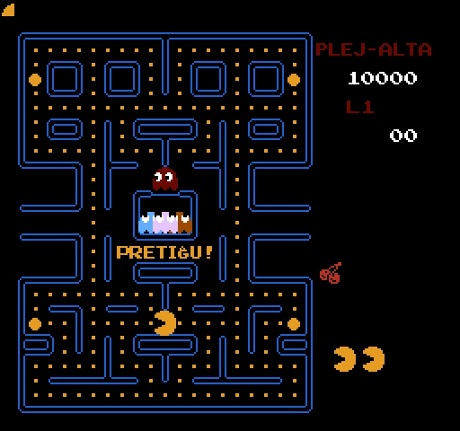

# Pac-Man

_Legu
[pacman-readme.txt](pacman-readme.txt) por esperanta priskrbo._

This project is a fan translation of
[Pac-Man](https://en.wikipedia.org/wiki/Pac-Man), a video game
for the Nintendo Entertainment System, to Esperanto. All
copyrights on the original game belong to Namco and Nintendo.

You *must* own a physical copy of the Pac-Man cartridge.
Downloading the ROM of any game which you do not own may be
considered piracy.

  * Pac-Man (USA) (Namco) - CRC32 `9E4E9CC2`

## Screenshots

Here are some pretty screenshots:

